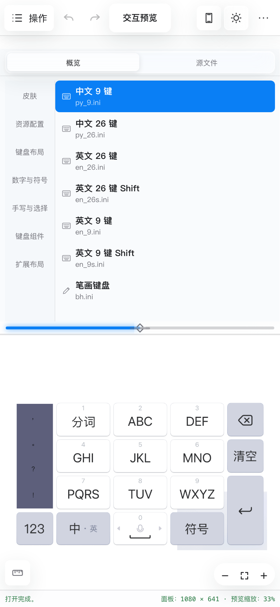

# 键设-bdiEditor

一个面向百度输入法 iOS `.bdi` 与 Android `.bds`、`.bda` 皮肤的可视化编辑器，支持 macOS、Windows 与 Android。它将皮肤文件、键盘布局、按键样式和图片资源集中到同一个实时预览工作流中，并提供新建、编辑、撤销/重做、保存与跨平台导出能力。

桌面端采用文件导航、实时画布与属性检查器三栏布局；移动端改为可调节的上下分屏，方便在文件、画布和属性之间切换。界面支持浅色/深色模式、设备安全区与轻量毛玻璃效果，皮肤文件始终在本地处理。

## 在线版本

- 国内：[https://bdieditor-bdieditor-d4gdhm3ir22dcc04c.webapps.tcloudbase.com/](https://bdieditor-bdieditor-d4gdhm3ir22dcc04c.webapps.tcloudbase.com/)
- 海外：[https://rekazer0.github.io/BdiEditor/](https://rekazer0.github.io/BdiEditor/)

## 界面预览

### PC 端


### 移动端

<p align="center">
  
</p>

## v1.9.109 更新

- 画布背景可直接从设备选择器切换，新增灰色背景，并与设置和默认设备保持同步。
- 源码样式图库支持选择后直接写回源码并同步预览。
- 修复源码辅助设置启动后未生效，以及补全键盘操作和颜色、样式值点击偶发失效的问题。

完整记录见 [CHANGELOG.md](CHANGELOG.md)。

## 快速上手

1. 点击左上角“打开”选择现有 `.bdi`、`.bds` 或 `.bda` 文件；也可点击“新建项目”，从百度官方模板或 5 套互联网整理 BDS 皮肤开始。
2. 在左侧“概览”中选择键盘布局、候选栏、工具栏或其他组件；切到“源文件”可像 Finder 一样浏览项目文件。
3. 使用画布上方控件切换设备、横竖屏、皮肤明暗和辅助线。选择手机时会按对应屏幕与安全区预览。
4. 切换到“编辑模式”后点击按键，在右侧检查器修改尺寸、位置、动作、颜色和图片。BDA 的几何与动作来自官方基础布局并只读，可编辑图片 ID、字体、字号和文字颜色。点击图片缩略图可查看处理后的实际效果。
5. 多选时，macOS 使用 `Command + 单击`，Windows 使用 `Ctrl + 单击`；使用 `Shift + 单击`可连续选择两个按键之间的全部按键。
6. 右键选中的按键可复制或删除；右侧“源代码”会定位并整行高亮对应配置。
7. 完成后点击“保存”；旧格式还可通过左上角“导出”生成 iOS `.bdi` / Android `.bds` 文件，BDA 保持 protobuf 格式保存。

在右上角“更多 → 设置”中可切换软件外观、默认预览设备和画布背景。

内置皮肤为互联网下载整理，如有侵权请联系作者下架。

## 主要特性

- 打开、创建、保存 `.bdi/.bds/.bda` 皮肤；BDA 会按 `appearanceConfig`、面板集合和声音字段识别 iOS/Android 家族，可双向转换导出，而非仅修改 `SupportPlatform`；
- 按百度官方 protobuf 描述符解析 BDA 样式、面板、按键引用和资源 ID；结合安装包内的 1080 横竖屏基础几何显示各类布局，可编辑并保存按键图片 ID、字体、字号、文字颜色及包内 PNG，写回时保留未知 protobuf 字段；
- 自动识别九键、魔改九键和 26 键布局；
- 浅色/深色、竖屏/横屏实时预览；内置 iPhone 17 Pro、iPhone 17 Pro Max、Xiaomi 17、Pixel 10 Pro 与 Galaxy S25 Ultra 的厂商公布分辨率模板；
- 普通、按下/高亮、滑动方向和长按事件预览；
- 交互预览中的字面按键可进入模拟输入区；可视化切换符号、数字、ABC 与 `Z+页面`，其他 `Fxx/Sxx` 只记录事件；
- `Command + 单击`多选按键，Windows 使用 `Ctrl + 单击`；Shift 单击可选择锚点到目标之间的连续按键；
- 编辑模式右键复制或删除一个及多个按键；
- 拖动、等宽、等高、对齐、分布和精确间距；
- 编辑显示文字、点击输入、上下左右滑和长按动作；
- 编辑整体键盘高度、背景图片、背景透明色，以及按键背景/前景样式、字体、字号和正常/按下颜色；
- 多选按键后批量修改正常与按下图片；
- 解析和编辑皮肤名称、描述、作者、版本、平台与深色模式信息；
- 语义化导航并可视化预览皮肤信息、布局、候选栏、符号、工具栏、手写和资源；
- 配置源码提供 INI 语法高亮、选中 section 整行高亮与自动定位，编辑结果与画布实时同步；
- 保留注释、空行、字段顺序、未知字段和未修改资源；
- 保存时保留原始 ZIP 条目顺序、权限、时间扩展字段和未修改条目的压缩数据；
- 百度官方 Android BDA 默认皮肤、官方 BDS 旧版皮肤、5 套互联网整理 BDS 皮肤、新建皮肤、撤销/重做和未保存保护；
- 可选择默认、马赛克、白色或深色画布背景；
- 新建、打开、保存、另存为和图片替换具有统一的进行中/成功/取消/失败反馈；文件错误会显示原生错误对话框；
- `.bdi/.bds/.bda` 文件关联，可从 Finder 双击打开。

## 范围

0.3.2 只还原键盘外观和按键状态，不实现百度输入法的拼音候选算法、功能码执行或真实输入引擎。候选内容、输入区与页面切换属于编辑器模拟；未明确支持的 `Fxx/Sxx` 只显示含义或事件。

## 开发与构建

需要 Node.js 22.18+ 或 23.6+（`verify:*` 脚本直接以 `node` 运行 `.ts`，依赖默认启用的 type-stripping）、Rust stable，以及对应平台的 Tauri 2 系统依赖。

```bash
npm install
npm run typecheck
npm run build
npm run tauri dev
```

构建 macOS `.app`：

```bash
CI=true npm run tauri build -- --bundles app
```

构建结果位于 `src-tauri/target/release/bundle/macos/`。

在 Windows 上构建 NSIS `.exe`：

```powershell
npm run tauri build -- --bundles nsis
```

构建结果位于 `src-tauri/target/release/bundle/nsis/`。推送 `v*` 标签会由 GitHub Actions 同时构建并上传 macOS `.dmg` 与 Windows `.exe` 到 GitHub Release。

## 兼容性

当前保证兼容项目测试样本所属的百度 iOS 皮肤格式家族。所有未知文件和字段会被保留，但其他历史格式仍需真实样本验证。详情见皮肤格式规范。

界面支持跟随系统、浅色和深色模式，并使用轻量毛玻璃；Windows 使用系统 Mica 窗口材质。macOS 发布包使用 ad-hoc 签名，尚未使用 Apple Developer ID 公证；首次打开若被 Gatekeeper 拦截，请在 Finder 中右键应用并选择“打开”。Windows 版本依赖系统 WebView2 Runtime。

## 隐私

编辑器在本地处理皮肤文件，不上传皮肤、配置或图片。

## 技术交流与反馈

QQ群：228040912

## License

[LICENSE](LICENSE)
