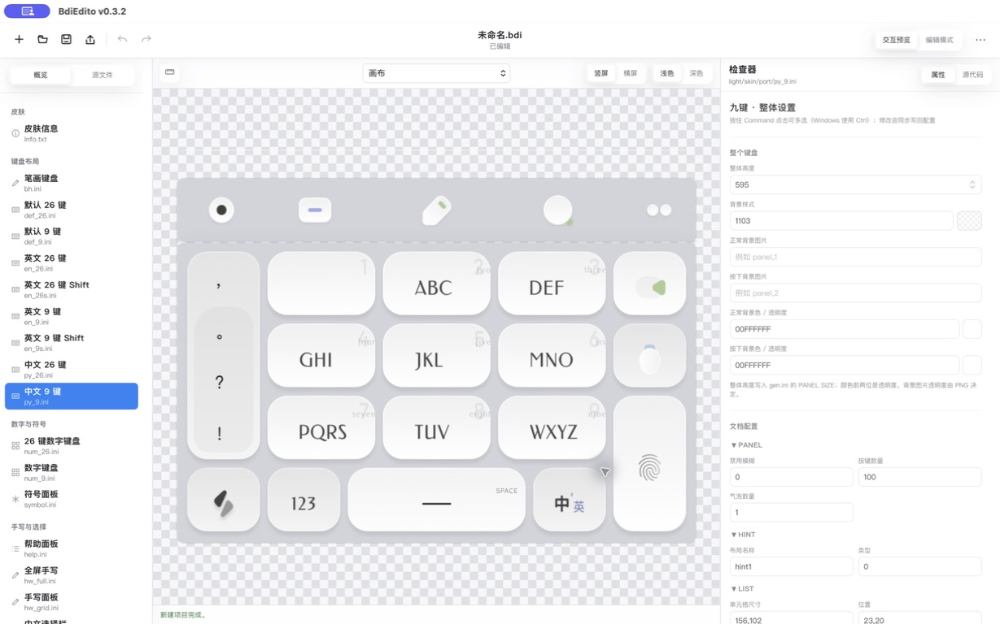
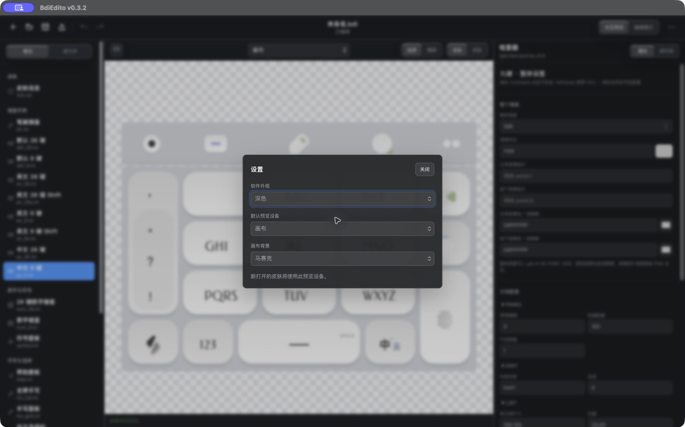

# BdiEdito

一个面向百度输入法 iOS `.bdi` 与 Android `.bds` 皮肤的可视化桌面编辑器。BdiEdito 让皮肤布局、按键样式与资源编辑回到可实时预览的桌面工作流。

支持 macOS 与 Windows，采用轻量的 Tauri 2 + 原生 HTML/CSS/TypeScript 技术栈。



## v0.3.2 更新

- 新增跟随系统、浅色和深色三种软件外观，设置会在下次启动时保留；
- 顶部工具栏、左右侧栏、菜单和分段控件统一为带动画的毛玻璃材质；Windows 窗口使用 Mica 材质；
- 修复“更多”和导出下拉菜单点击空白处不收起、层级遮挡及定位错误；
- 交互预览切换键盘页面时同步定位左侧布局，并保证英文界面返回原来的中文九键或 26 键布局；
- 重新整理概览分类，为所有配置文件提供整体属性解析；源文件列表采用接近 Finder 的选择、展开和键盘操作；
- 完善候选栏、工具栏、键盘整体配置、背景/前景样式和处理后图片预览；
- 新增画布辅助线、画布背景选择、Android 底部安全区、Shift 连续选择及编辑模式右键复制/删除；
- 修复按键交互错位、撤销或返回时预览闪烁、九键数量估算、源码光标错位与选中代码定位。

完整记录见 [CHANGELOG.md](CHANGELOG.md)。

## 快速上手

1. 点击左上角“打开”选择现有 `.bdi` 或 `.bds` 文件；也可点击“新建项目”，从默认模板或内置“尘埃”模板开始。
2. 在左侧“概览”中选择键盘布局、候选栏、工具栏或其他组件；切到“源文件”可像 Finder 一样浏览项目文件。
3. 使用画布上方控件切换设备、横竖屏、皮肤明暗和辅助线。选择手机时会按对应屏幕与安全区预览。
4. 切换到“编辑模式”后点击按键，在右侧检查器修改尺寸、位置、动作、颜色和图片。点击图片缩略图可查看处理后的实际效果。
5. 多选时，macOS 使用 `Command + 单击`，Windows 使用 `Ctrl + 单击`；使用 `Shift + 单击`可连续选择两个按键之间的全部按键。
6. 右键选中的按键可复制或删除；右侧“源代码”会定位并整行高亮对应配置。
7. 完成后点击“保存”，或通过左上角“导出”生成 iOS `.bdi` / Android `.bds` 文件。

在右上角“更多 → 设置”中可切换软件外观、默认预览设备和画布背景。



## 主要特性

- 打开、创建、保存 `.bdi/.bds` 皮肤；导出时会转换平台目录和 `SupportPlatform`，而非仅改扩展名；
- 自动识别九键、魔改九键和 26 键布局；
- 浅色/深色、竖屏/横屏实时预览；内置 iPhone 17 Pro、iPhone 17 Pro Max、Xiaomi 17、Pixel 10 Pro 与 Galaxy S25 Ultra 的厂商公布分辨率模板；
- 普通、按下/高亮、滑动方向和长按事件预览；
- 交互预览中的字面按键可进入模拟输入区；可视化切换符号、数字、ABC 与 `Z+页面`，其他 `Fxx/Sxx` 只记录事件；
- `Command + 单击`多选按键，Windows 使用 `Ctrl + 单击`；Shift 单击可选择锚点到目标之间的连续按键；
- 编辑模式右键复制或删除一个及多个按键；
- 拖动、等宽、等高、对齐、分布和精确间距；
- 编辑显示文字、点击输入、上下左右滑和长按动作；
- 编辑整体键盘高度、背景图片、背景透明色，以及按键背景/前景样式、字体、字号和正常/按下颜色；
- 多选按键后批量修改正常与按下图片；
- 解析和编辑皮肤名称、描述、作者、版本、平台与深色模式信息；
- 语义化导航并可视化预览皮肤信息、布局、候选栏、符号、工具栏、手写和资源；
- 配置源码提供 INI 语法高亮、选中 section 整行高亮与自动定位，编辑结果与画布实时同步；
- 保留注释、空行、字段顺序、未知字段和未修改资源；
- 保存时保留原始 ZIP 条目顺序、权限、时间扩展字段和未修改条目的压缩数据；
- 默认皮肤模板、4 套“尘埃”内置模板、新建皮肤、撤销/重做和未保存保护；
- 可选择默认、马赛克、白色或深色画布背景；
- 新建、打开、保存、另存为和图片替换具有统一的进行中/成功/取消/失败反馈；文件错误会显示原生错误对话框；
- `.bdi/.bds` 文件关联，可从 Finder 双击打开。

## 范围

0.3.2 只还原键盘外观和按键状态，不实现百度输入法的拼音候选算法、功能码执行或真实输入引擎。候选内容、输入区与页面切换属于编辑器模拟；未明确支持的 `Fxx/Sxx` 只显示含义或事件。

## 开发与构建

需要 Node.js 20.19+ 或 22.12+、Rust stable，以及对应平台的 Tauri 2 系统依赖。

```bash
npm install
npm test
npm run build
npm run tauri dev
```

构建 macOS `.app`：

```bash
CI=true npm run tauri build -- --bundles app
```

构建结果位于 `src-tauri/target/release/bundle/macos/`。

在 Windows 上构建 NSIS `.exe`：

```powershell
npm run tauri build -- --bundles nsis
```

构建结果位于 `src-tauri/target/release/bundle/nsis/`。推送 `v*` 标签会由 GitHub Actions 同时构建并上传 macOS `.dmg` 与 Windows `.exe` 到 GitHub Release。

## 兼容性

当前保证兼容项目测试样本所属的百度 iOS 皮肤格式家族。所有未知文件和字段会被保留，但其他历史格式仍需真实样本验证。详情见 [兼容性说明](docs/compatibility.md)。

界面支持跟随系统、浅色和深色模式，并使用轻量毛玻璃；Windows 使用系统 Mica 窗口材质。macOS 发布包使用 ad-hoc 签名，尚未使用 Apple Developer ID 公证；首次打开若被 Gatekeeper 拦截，请在 Finder 中右键应用并选择“打开”。Windows 版本依赖系统 WebView2 Runtime。

## 隐私

编辑器在本地处理皮肤文件，不上传皮肤、配置或图片。

## License

[LICENSE](LICENSE)
